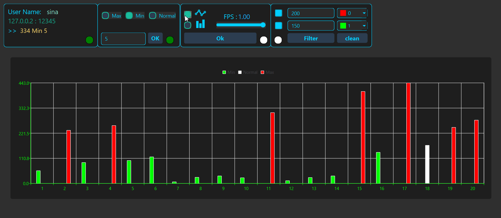

# 🔌 Socket Programming in C++

This project is a basic implementation of socket programming using TCP.

- 🖥️ **Client**: Implemented in C++
- 🌐 **Server**: Implemented in Python


---

## 📁 Project Structure

```
Socket_Programming/
├── client/
│   ├── main.cpp
│   ├── CMakeLists.txt
│   ├── Doxyfile
│   └── ...
│
├── server/
│   ├── main.py
│   ├── GenerateData/
│   │   ├── ...
│   │   └── my_data.npy
│   │   
│   ├── ...
│   └── config.json
│
├── docs/
│   └── (Doxygen generated documentation files)
│
```

---

## 📚 Documentation (Doxygen)

The full client-side (C++) documentation is available here:

👉 [**View Online Documentation**](https://sinayademellat.github.io/Socket_Programming/)

To regenerate documentation locally using **Doxygen + Graphviz**:

```bash
cd client
doxygen Doxyfile
```

Make sure `graphviz` is installed to enable class diagrams.

---


## ⚙️ Server Configuration

- Default server IP: `127.0.0.2`
- Port: `12345`
- Username: `sina`
- Password: `yad`

### To change basic server settings:
Edit the file:
```
server/config.json
```

### To modify data sent from server:
Update the file:
```
server/my_data.npy
```
---

## 🛠 How to Run

### 🔷 Server (Python)

#### Run the server:
```bash
cd server
python main.py
```

---

### 🔷 Client (C++ with Qt 6)

> ⚠️ This project uses **Qt 6**. Make sure it is installed and available to CMake.

#### Requirements:
- Qt 6
- CMake
- g++ or Visual Studio compiler


